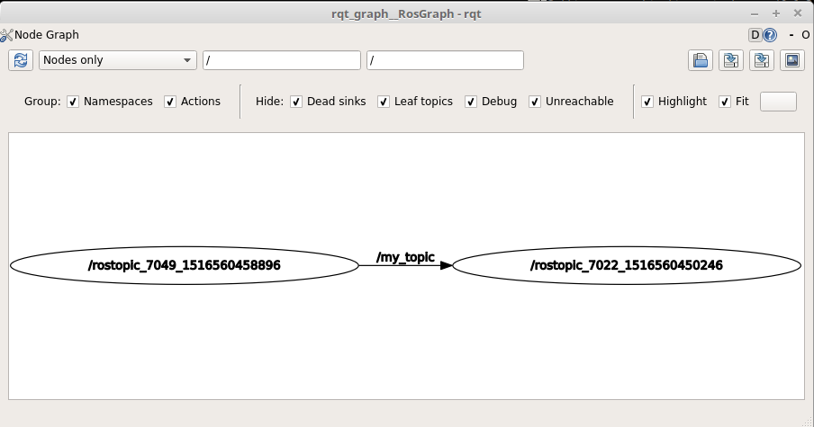

# TP1: first steps ROS
## Introduction to the environment
In the following you will practice the basics of ROS: subscribing and publishing to a **topic**, creates your first **node** and controlling a robot with the keyboard.

All the ROS environment is already setup into a Docker container. To start it, enter the following command line:
```sh
./run.sh
```
To exit the container, use `Ctrl` + `D`, or the command line:
```sh
exit
```

ROS needs lots terminals to run the commands we need in this TP. So, we are encouraging you to use a terminal multiplexer, as *terminator* or *tmux*.

Run `terminator` command to open a new windows with **terminator**. Here some usefull shortcuts:

- Toggle fullscreen: `F11`
- Split terminals horizontally: `Ctrl` + `Shift` + `O`
- Split terminals vertically: `Ctrl` + `Shift` + `E`
- Close current Panel: `Ctrl` + `Shift` + `W`
- Open new tab: `Ctrl` + `Shift` + `T`
- Move to the terminal above the current one: `Alt` + `↑`
- Move to the terminal below the current one: `Alt` + `↓`
- Move to the terminal left of the current one: `Alt` + `←`
- Move to the terminal right of the current one: `Alt` + `→`


## Part 1: publishing/subscribing to a topic
The first thing you should run is the **roscore** when you ROS, with the command:
```sh
roscore
```

Now open a new terminal abouve ( `Ctrl` + `Shift` + `O` ) and split it in two ( `Ctrl` + `Shift` + `E` ). You can click or use the shortcuts to navigates between the terminals.

In one terminal, subscribe to the topic `/my_topic`, with the following command:
```sh
rostopic echo /my_topic
```

In the oher terminal, publish a message to this topic:
```sh
rostopic pub /my_topic std_msgs/Float32 "data: 42.0"
```

The message sent will be shown in the first terminal. Well done, you just publish your first message in ROS!

#### Tips:
- to kill a command you can use `Crtl` + `C`
- try to change the value of the data send by the publisher to understand the mechanism
- you can publish a value with a specific rate, with the option `-r`. For a message sent each second:
  ```sh
  rostopic pub -r 1.0 /my_topic std_msgs/Float32 "data: 42.0"
  ```
- use `rostopic list` to list all topics avalaible
- you can show the connexion between nodes using the command `rqt_graph`
  


## Part 2: let's code it in Python!
#### Publisher node
This node called `talker` will publish a `std_msgs::Float32` message to the topic `/counter`.

Complete the following code to publish every seconds the current counter, incremented by one at every loop cycle:

```python
#!/usr/bin/env python

# python client for ROS
import rospy
# Float32 message
from std_msgs.msg import Float32

def talker():
    # init the node: rospy.init_node(NODE_NAME)
    rospy.init_node()

    # init the publisher with the method signature: rospy.Publisher(TOPIC_NAME, MESSAGE_TYPE)
    pub = rospy.Publisher()

    # publisher rate: 1Hz
    rate = rospy.Rate(1)
    counter = 0

    # counter loop
    while not rospy.is_shutdown():
        # COMPLETE HERE TO PUBLISH THE MESSAGE

        # apply the publishing rate
        rate.sleep()

if __name__ == '__main__':
    try:
        talker()
    except rospy.ROSInterruptException:
        pass
```

Save the code into `talker.py` file, then execute the node with the command:
```sh
python talker.py
```

#### Subscriber node
This node called `listener` will subscribe to the topic `/counter` and print the message to the output.

Complete the following code into `listener.py` file:

```python
#!/usr/bin/env python
import rospy
from std_msgs.msg import Float32

def callback(counter):
    rospy.loginfo("counter value: %d", counter.data)

def listener():
    # COMPLETE HERE
    rospy.init_node()

    # init the subscriber with the method signature: rospy.Subsciber(TOPIC_NAME, MESSAGE_TYPE, CALLBACK_METHOD)
    sub = rospy.Subscriber()

    # spin() simply keeps python from exiting until this node is stopped
    rospy.spin()

if __name__ == '__main__':
    try:
        listener()
    except rospy.ROSInterruptException:
        pass
```

Execute the node with the command:
```sh
python listener.py
```


## Part 3: controlling a robot with the keyboard
Writes a node to control the **TurtleSim** robot using the keyboard. You will use:
- the TurtleSim viewer with the command: `rosrun turtlesim turtlesim_node`
- find the topic to publish on, with: `rosnode info NODE_NAME`
- explore the message needed by the robot: `rostopic info TOPIC_NAME`
- find the message specifications, with: `rosmsg show MSG_NAME`

#### Tips
- code for `UP` is key 65
- code for `DOWN` is key 66
- code for `RIGHT` is key 67
- code for `LEFT` is key 68
- you can access to the key code with:
  ```python
  import sys
  import tty
  tty.setcbreak(sys.stdin)
  while True:
      key = ord(sys.stdin.read(1))
  ```
